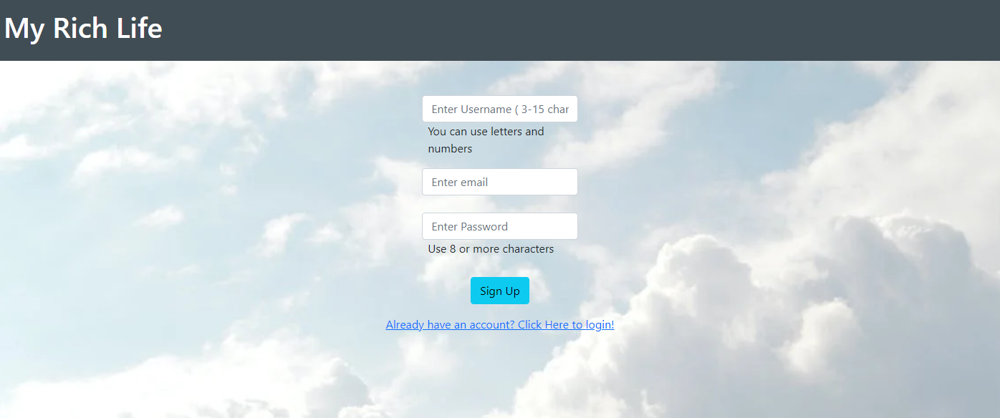
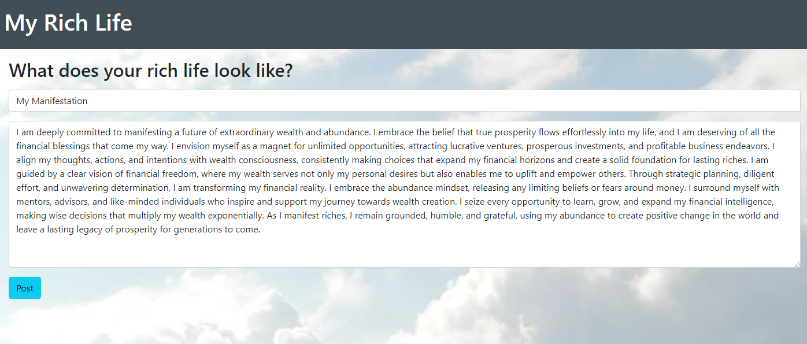

# Rich Lifestyle

## Table of Contents

* [Description](#description)
* [Demo](#demo)
* [Credits](#credits)
* [Links](#links)

## Description

This website is designed as a hub in which the user is able to leave a comment description of goals and aspirations they have in attaining their 'rich lifestyle', and then being able to see their ideas become tangible posts that can help keep them accountable. These posts are visibile to other users in a community message board structure. 

The user is greeted with a login page that prompts them to use their credentials or sign-up to do so. They are then taken to a dashboard which allows them to post. They can use the dropdown in the navbar to navigate to the home page, where all users' posts are populated in cards. These cards can then be clicked on and take the user to a page where they can view the full post and/or reply. Credentials and posts are stored in a database. 

## Demo

Demonstration of the Sign Up Page:

Demostartion of the Login Page:

Demonstration of the post page:

## Credits

We would like to thank the following people for their contributions to this project: Frank Colorado, Apollo Demirel, Bader Mahdawi, Kaleo Dutta-allen, Deshan Meemanage, and the TAs and instructor. We would also like to thank the following resources for their help: BootStrap, Node.js, Express.js, Sequelize, MySQL, Handlebars, and Heroku. We also used resources from past classwork and homework assignments to help us with this project.

## Links

Github: [Rich Lifestyle Repo](https://github.com/Frank-Colorado/rich-life-style).
Heroku: [Rich Lifestyle Heroku Web App](https://rich.herokuapp.com/signup).
